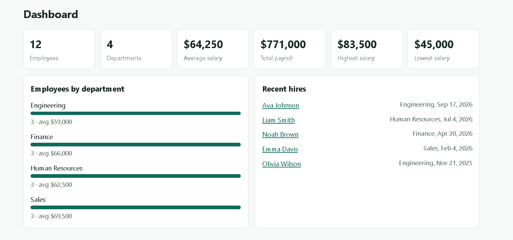
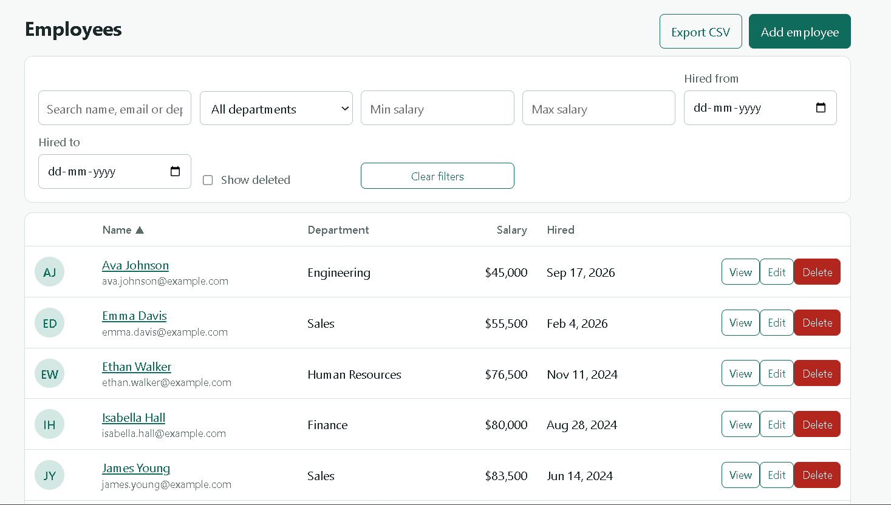

# Employee Management System

A full-stack employee management app with role-based access, built with **ASP.NET Core 9 Web API**, **Entity Framework Core**, **SQL Server** and **Angular 20**.

## Screenshots

**Dashboard**



**Employee list** with search, filters, sorting and pagination



## Features

- Employee CRUD with server-side **pagination**, **sorting** and **advanced filters** (department, salary range, hire-date range)
- Employee **details page** with profile photo upload
- **Department management** (Admin only)
- **Dashboard**: headcount, department count, salary statistics, recent hires
- **JWT login** and **role-based authorization** (Admin / User)
- **Export to CSV** (opens in Excel), respecting the current filters
- **Audit log** of who created, changed, deleted or restored records
- **Soft delete** with restore

## Tech stack

| Layer | Technology |
|-------|-----------|
| API | ASP.NET Core 9 Web API, JWT bearer authentication |
| Data | Entity Framework Core 9, SQL Server (LocalDB works) |
| Front end | Angular 20 (standalone components, signals, route guards, HTTP interceptor) |

## Demo accounts (created automatically on first run)

| User  | Password  | Role  | Can do |
|-------|-----------|-------|--------|
| admin | Admin@123 | Admin | everything |
| user  | User@123  | User  | view, search, filter, export |

## Getting started

### Prerequisites
- .NET 9 SDK
- Node.js 20.19+ or 22.12+
- SQL Server or SQL Server LocalDB

### 1. Run the API

```bash
cd api
dotnet restore
dotnet run --urls http://localhost:5000
```

On first start the app applies the included migrations, creates the `EmployeeMgmtDb` database and seeds 4 departments, 12 employees and 2 users.
To use another SQL Server, edit `ConnectionStrings:Default` in `api/appsettings.json`.

To open Swagger (http://localhost:5000/swagger), run in Development mode first:

```powershell
$env:ASPNETCORE_ENVIRONMENT="Development"
```

If you change the entity classes, create a new migration with `dotnet ef migrations add <Name>` (install the tool once with `dotnet tool install --global dotnet-ef`).

### 2. Run the Angular app

```bash
cd web
npm install
npm start
```

Open http://localhost:4200. The API address is set in `web/src/app/config.ts`.

## API summary

| Method | Route | Access |
|--------|-------|--------|
| POST | `/api/auth/login` | public |
| GET | `/api/employees` (`search`, `departmentId`, `minSalary`, `maxSalary`, `hiredFrom`, `hiredTo`, `sortBy`, `sortDir`, `page`, `pageSize`, `includeDeleted`) | any user |
| GET | `/api/employees/export` (same filters) | any user |
| GET | `/api/employees/{id}` | any user |
| POST / PUT / DELETE | `/api/employees`, `/api/employees/{id}` | Admin |
| POST | `/api/employees/{id}/restore`, `/api/employees/{id}/photo` | Admin |
| GET | `/api/departments` | any user |
| POST / PUT / DELETE | `/api/departments` | Admin |
| GET | `/api/dashboard` | any user |
| GET | `/api/audit` | Admin |

## Project structure

```
api/          ASP.NET Core Web API (Controllers, Models, Data, Services, Migrations)
web/          Angular front end (src/app: components, auth, API service)
screenshots/  Images used in this README
```

## Notes for production

This is a portfolio project. Before deploying: replace `Jwt:Key` with a secret from environment variables or a vault, serve over HTTPS, and restrict CORS to your real domain.

## Author

**Rohit Shinde** — Fresher Software Developer (.NET)
[LinkedIn](https://linkedin.com/in/rohit270727) · [GitHub](https://github.com/rohit270727)
